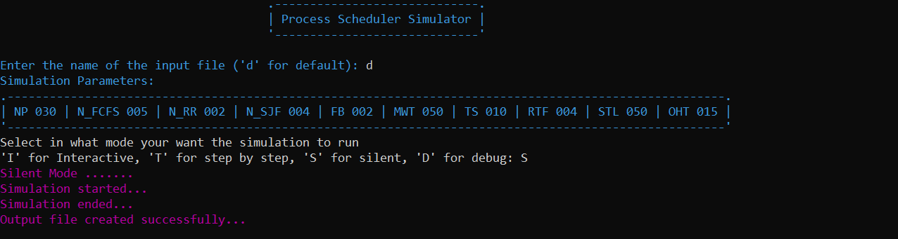
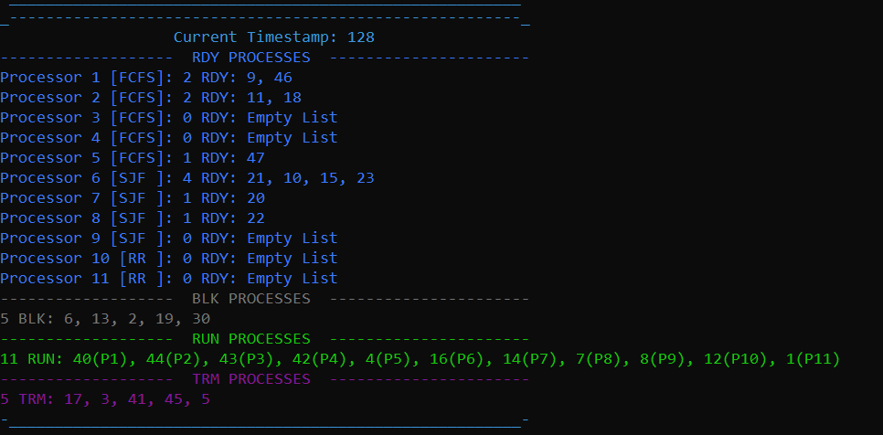
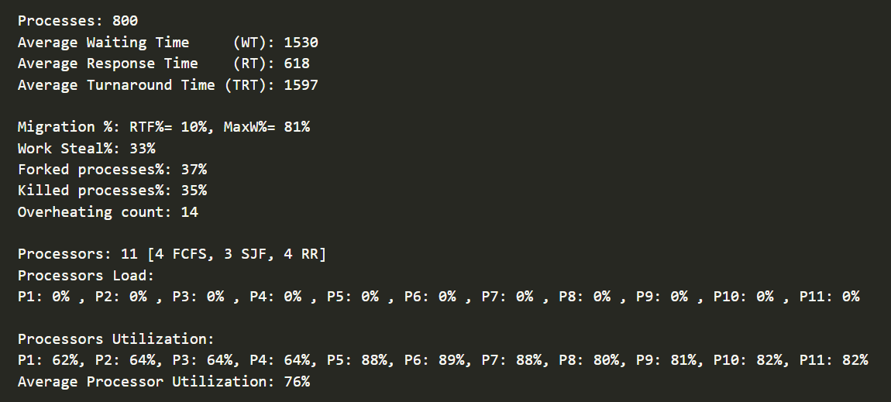

# Process Scheduler
A simple process scheduler  
Made as a project for Data Structures &amp; Algorithms course in Computer Engineering Department first-year Cairo University.

---

## 💡 Abstract
 - The system is a multiprocessor, it uses three kinds of process Scheduling algorithms:
   - FCFS --> First Come First Serve
   - SJF  --> Shortest Job First
   - RR   --> Round Robin
 - There are 3 interface moodes:
   - Interactive
   - Step-By-Step
   - Silent
 - Info is taken from an input file
 - Statistics is displayed in and output file

---

## 💎 Our team
- [Akram Hany](https://github.com/akramhany)
- [Ahmed Hamed](https://github.com/AhmedHamed3699)
- [Amir Kedis](https://github.com/amir-kedis)

---

## 📷 Screenshots

### Silent Mode

---

### Sample Timestamp

---

### Sample Output Stats

---